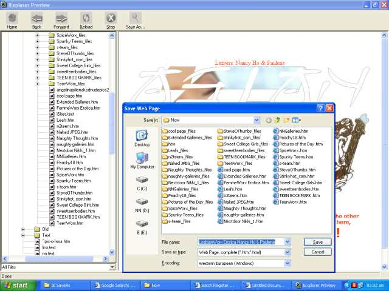



## Browse HTML Files Easily

### Description

Easily browse saved HTML files, using the WebBrowser control...

Folder Treeview by Scythe <scythe@cablenet.de>

Splitter control by Tim Humphrey <zzhumphreyt@techie.com> modified by <dseaman@ieg.com.br>

ALL the rest is mine!
 
### More Info
 

             |
---                |---
**Submitted On**   |2004-12-14 08:10:26
**By**             |[M\. J\. Highlander](https://github.com/Planet-Source-Code/PSCIndex/blob/master/ByAuthor/m-j-highlander.md)
**Level**          |Intermediate
**User Rating**    |4.8 (19 globes from 4 users)
**Compatibility**  |VB 6\.0
**Category**       |[Complete Applications](https://github.com/Planet-Source-Code/PSCIndex/blob/master/ByCategory/complete-applications__1-27.md)
**World**          |[Visual Basic](https://github.com/Planet-Source-Code/PSCIndex/blob/master/ByWorld/visual-basic.md)
**Archive File**   |[Browse\_HTM18312912192004\.zip](https://github.com/Planet-Source-Code/m-j-highlander-browse-html-files-easily__1-57815/archive/master.zip)

